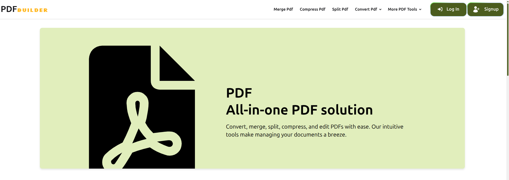
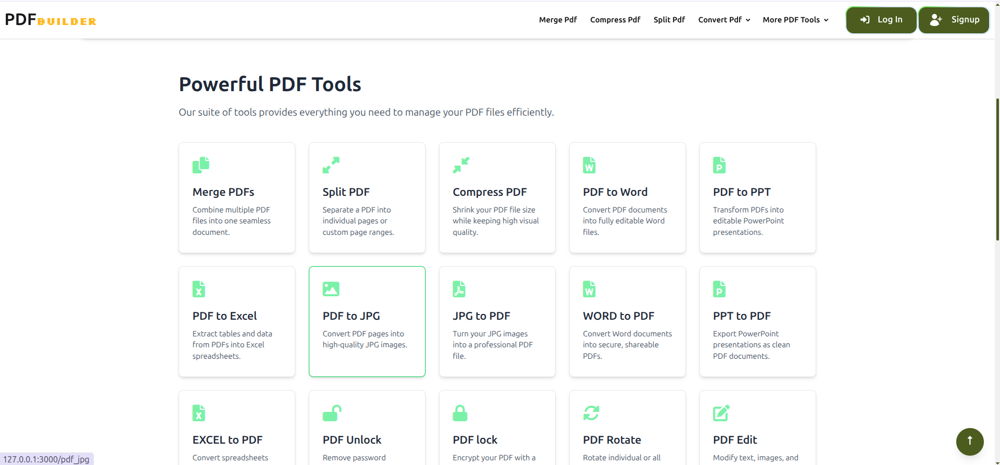
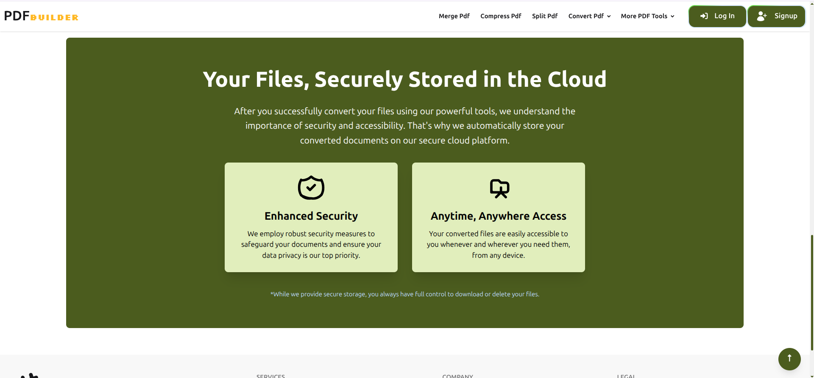
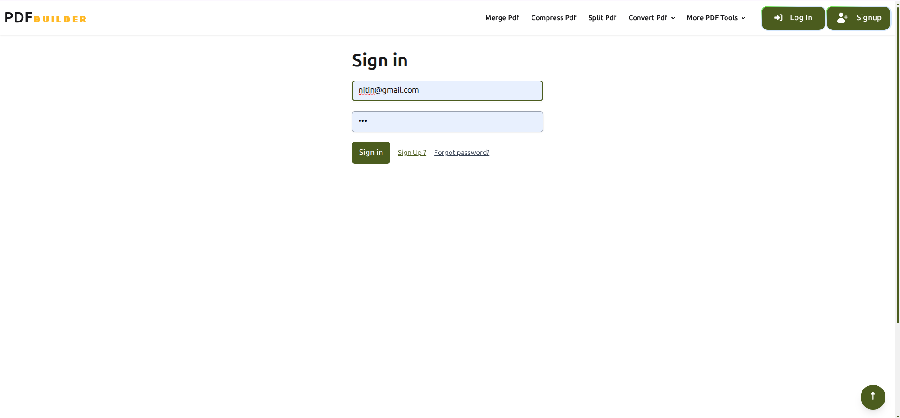
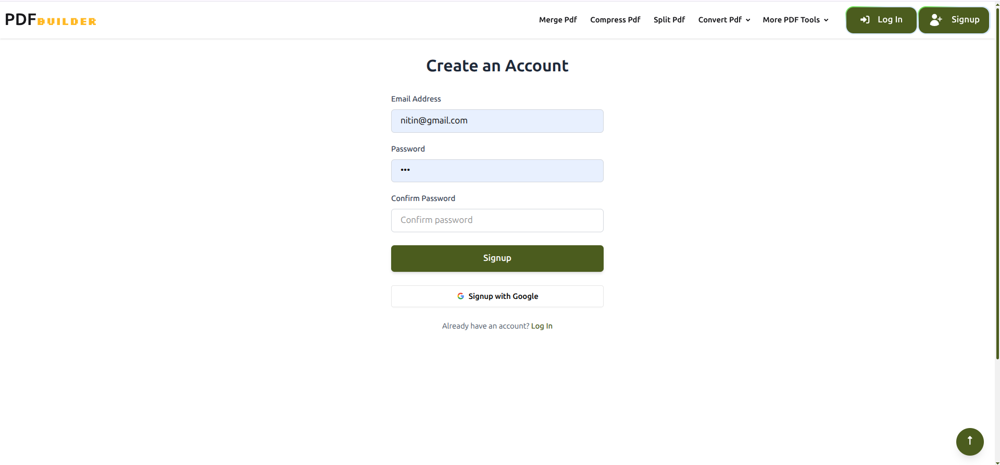
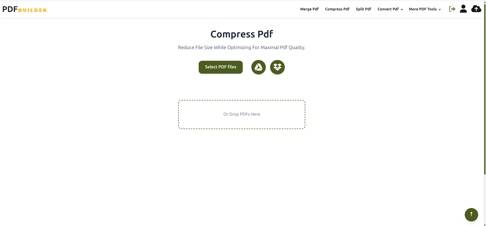
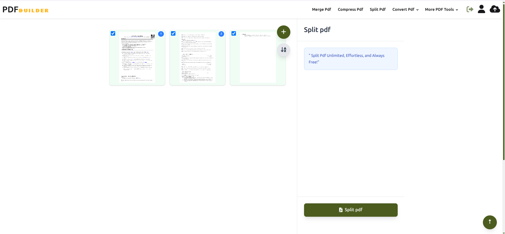
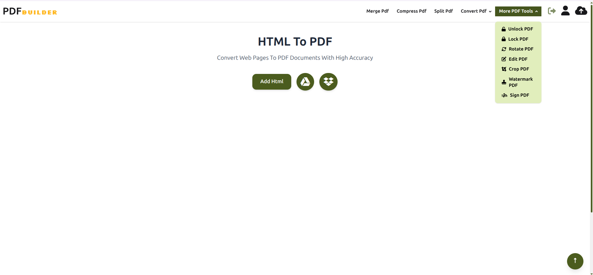
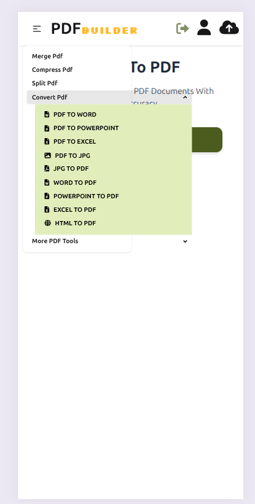

# 📄 pdfbuilder

A Ruby on Rails application for building and managing PDFs.
**Version**: black

---

## 🚀 Getting Started

### 🔧 Requirements

- Ruby (ruby-3.4.2)
- Rails (version 8.0.0)
- PostgreSQL
- Git

---

### 📥 Cloning the Repository

```bash
git clone https://github.com/NitinGojiya/pdf_builder
cd pdf_builder

⚙️ Installation

bundle install

🗃️ Database Setup
rails db:create
rails db:migrate
rails db:seed # optional

🧰 Services Used
PostgreSQL for the database

📸 Screen
* Home Page

* ...









👨‍💻 Author
Nitin Gojiya https://nitingojiya.vercel.app/
